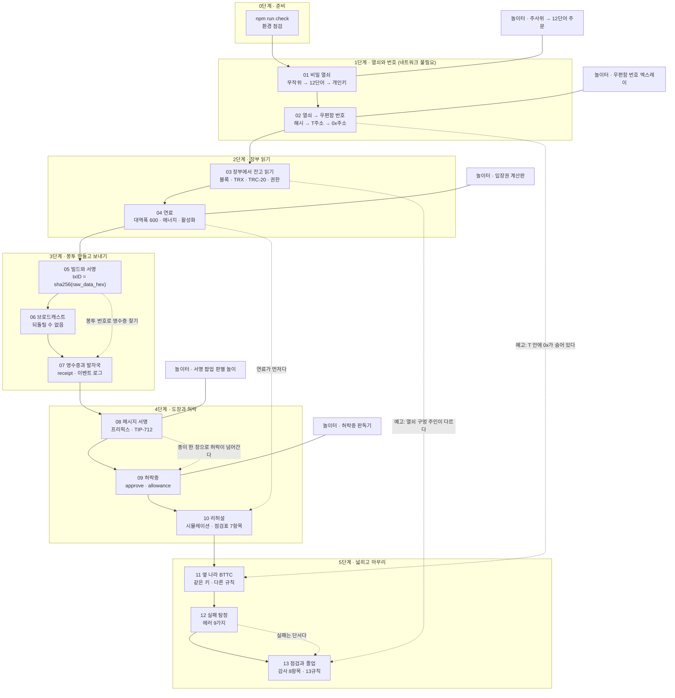
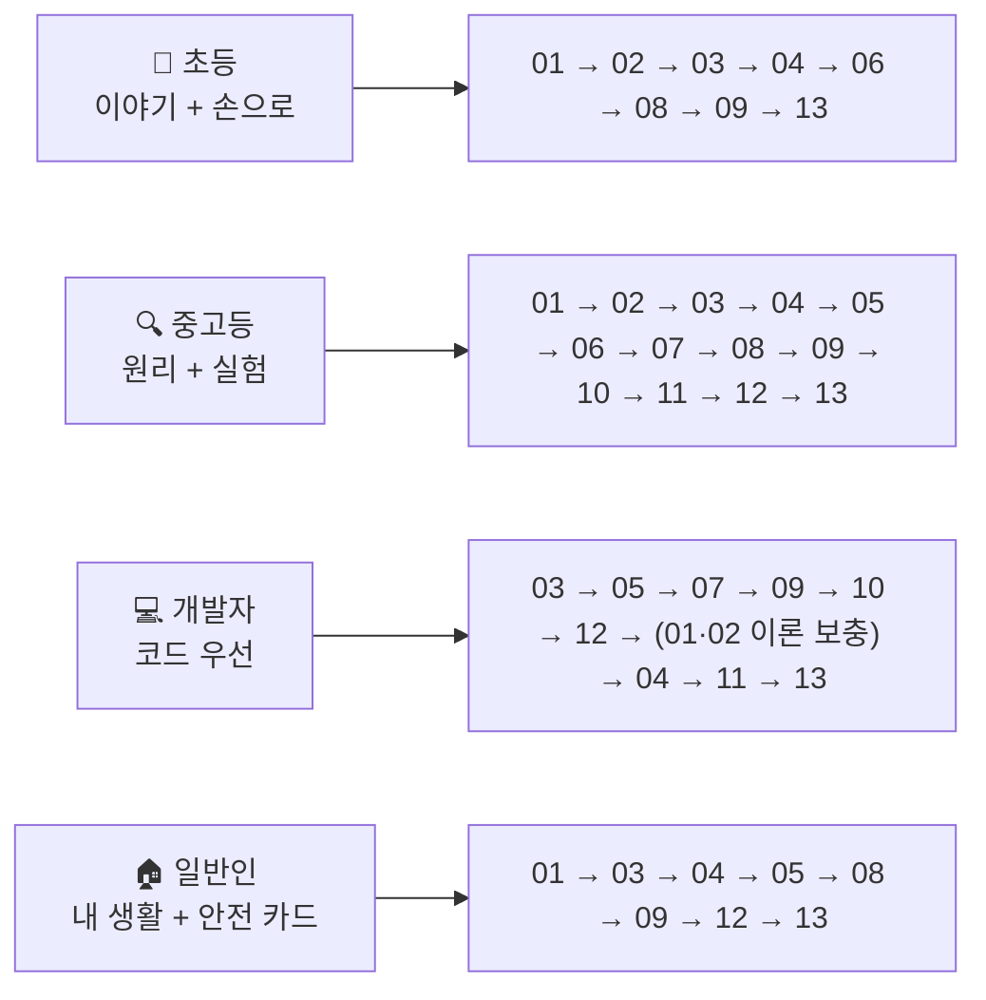

# 커리큘럼 지도 (CURRICULUM MAP)

13개 레슨이 8개 핵심 개념을 어떤 순서로, 어떤 깊이로 다루는지 한 장에 모았습니다. 가르치는 사람이 "이 반에는 어디까지"를 정할 때, 배우는 사람이 "내가 어디쯤인지"를 볼 때 씁니다.

- 용어의 뜻은 [GLOSSARY.md](GLOSSARY.md)
- 개발자용 API·상수·에러 문구는 [CHEATSHEET.md](CHEATSHEET.md)
- 인물·말투·비유의 한계는 [docs/story-bible.md](docs/story-bible.md)

검증 기준일: 2026-09-12 (Node 23.11, tronweb 6.5.0, ethers 6.17.0)

---

## (a) 핵심 개념 8개 × 레슨 13개 × 대상 4개

### 개념 8개

| # | 개념 | 이 저장소에서 뜻하는 것 |
|---|---|---|
| 1 | **무작위** | 엔트로피 → 니모닉 → 시드. "아무도 못 맞히는 수"가 지갑의 출발점이라는 것 |
| 2 | **해시** | keccak256 / sha256. 되돌릴 수 없는 한 방향 계산과 그 쓰임(주소, txID, 선택자, 토픽) |
| 3 | **키와 주소** | 개인키 · 공개키 · T주소 · 0x주소 · 파생 경로. 무엇을 공개하고 무엇을 숨기는지 |
| 4 | **장부** | 블록체인 조회. 블록·확정 블록·잔고·계정·컨트랙트·최근 거래 |
| 5 | **자원** | 대역폭 · 에너지 · TRX 소각 · 스테이킹 · feeLimit · gas. 트론에서 "연료"가 무엇인지 |
| 6 | **서명** | 트랜잭션 서명, 메시지 서명, TIP-712. 무엇에 도장을 찍는지 읽는 힘 |
| 7 | **허락** | approve / allowance / 계정 권한(owner·active permission). 내가 남에게 준 권한 |
| 8 | **검증** | 영수증·시뮬레이션·복원 주소 비교·에러 읽기. "말"이 아니라 "값"으로 확인하는 습관 |

### 칸의 뜻

| 칸 | 뜻 |
|---|---|
| **없음** | 그 레슨의 그 대상 섹션에서 다루지 않음 |
| **맛보기** | 한 줄 언급 또는 예고. 이 레슨에서 배우는 것은 아님 |
| **이해** | 설명이 있고, 값이나 화면으로 확인함 |
| **구현** | 직접 계산하거나, 손으로 만들거나, 코드로 실행해 값을 얻음 |

### 🧒 초등 (`#story` · `#hands` 앞부분)

| 개념 \ 레슨 | 01 | 02 | 03 | 04 | 05 | 06 | 07 | 08 | 09 | 10 | 11 | 12 | 13 |
|---|---|---|---|---|---|---|---|---|---|---|---|---|---|
| 무작위 | 이해 | 맛보기 | 없음 | 없음 | 없음 | 없음 | 없음 | 없음 | 없음 | 없음 | 없음 | 없음 | 없음 |
| 해시 | 없음 | 이해 | 없음 | 없음 | 맛보기 | 없음 | 맛보기 | 맛보기 | 없음 | 없음 | 없음 | 없음 | 없음 |
| 키와 주소 | 이해 | 이해 | 맛보기 | 없음 | 맛보기 | 맛보기 | 없음 | 맛보기 | 없음 | 없음 | 이해 | 맛보기 | 맛보기 |
| 장부 | 맛보기 | 없음 | 이해 | 맛보기 | 맛보기 | 이해 | 이해 | 없음 | 이해 | 맛보기 | 맛보기 | 맛보기 | 이해 |
| 자원 | 없음 | 없음 | 맛보기 | 이해 | 맛보기 | 이해 | 이해 | 맛보기 | 맛보기 | 이해 | 이해 | 맛보기 | 맛보기 |
| 서명 | 맛보기 | 없음 | 없음 | 없음 | 이해 | 이해 | 맛보기 | 이해 | 맛보기 | 없음 | 맛보기 | 맛보기 | 없음 |
| 허락 | 없음 | 없음 | 맛보기 | 없음 | 없음 | 없음 | 없음 | 맛보기 | 이해 | 맛보기 | 없음 | 맛보기 | 이해 |
| 검증 | 맛보기 | 맛보기 | 이해 | 없음 | 이해 | 맛보기 | 이해 | 이해 | 맛보기 | 이해 | 맛보기 | 이해 | 이해 |

### 🔍 중고등 (`#hands` · `#why`)

| 개념 \ 레슨 | 01 | 02 | 03 | 04 | 05 | 06 | 07 | 08 | 09 | 10 | 11 | 12 | 13 |
|---|---|---|---|---|---|---|---|---|---|---|---|---|---|
| 무작위 | 구현 | 이해 | 없음 | 맛보기 | 없음 | 없음 | 없음 | 없음 | 없음 | 없음 | 맛보기 | 맛보기 | 맛보기 |
| 해시 | 이해 | 구현 | 없음 | 없음 | 이해 | 맛보기 | 이해 | 이해 | 이해 | 없음 | 맛보기 | 없음 | 없음 |
| 키와 주소 | 이해 | 구현 | 이해 | 맛보기 | 이해 | 이해 | 이해 | 이해 | 이해 | 맛보기 | 구현 | 이해 | 이해 |
| 장부 | 맛보기 | 없음 | 구현 | 이해 | 이해 | 구현 | 이해 | 없음 | 이해 | 이해 | 이해 | 이해 | 구현 |
| 자원 | 없음 | 없음 | 맛보기 | 구현 | 이해 | 이해 | 구현 | 이해 | 이해 | 구현 | 이해 | 이해 | 이해 |
| 서명 | 맛보기 | 맛보기 | 없음 | 없음 | 구현 | 이해 | 이해 | 구현 | 이해 | 맛보기 | 이해 | 이해 | 맛보기 |
| 허락 | 없음 | 없음 | 맛보기 | 없음 | 없음 | 없음 | 맛보기 | 이해 | 구현 | 이해 | 없음 | 이해 | 구현 |
| 검증 | 이해 | 이해 | 이해 | 이해 | 이해 | 이해 | 구현 | 구현 | 이해 | 구현 | 이해 | 구현 | 구현 |

### 💻 대학·개발자 (`#code`)

| 개념 \ 레슨 | 01 | 02 | 03 | 04 | 05 | 06 | 07 | 08 | 09 | 10 | 11 | 12 | 13 |
|---|---|---|---|---|---|---|---|---|---|---|---|---|---|
| 무작위 | 구현 | 이해 | 없음 | 구현 | 없음 | 없음 | 없음 | 없음 | 없음 | 없음 | 맛보기 | 구현 | 맛보기 |
| 해시 | 이해 | 구현 | 없음 | 없음 | 구현 | 이해 | 구현 | 구현 | 구현 | 없음 | 이해 | 없음 | 없음 |
| 키와 주소 | 구현 | 구현 | 구현 | 이해 | 구현 | 구현 | 구현 | 구현 | 구현 | 이해 | 구현 | 구현 | 구현 |
| 장부 | 없음 | 없음 | 구현 | 구현 | 이해 | 구현 | 구현 | 없음 | 구현 | 구현 | 구현 | 구현 | 구현 |
| 자원 | 없음 | 없음 | 이해 | 구현 | 이해 | 구현 | 구현 | 이해 | 구현 | 구현 | 구현 | 이해 | 구현 |
| 서명 | 맛보기 | 이해 | 없음 | 없음 | 구현 | 구현 | 이해 | 구현 | 구현 | 맛보기 | 구현 | 구현 | 맛보기 |
| 허락 | 없음 | 없음 | 이해 | 없음 | 없음 | 없음 | 맛보기 | 이해 | 구현 | 구현 | 없음 | 구현 | 구현 |
| 검증 | 구현 | 구현 | 이해 | 이해 | 구현 | 구현 | 구현 | 구현 | 구현 | 구현 | 구현 | 구현 | 구현 |

### 🏠 일반인 (`#life` · `#card`)

| 개념 \ 레슨 | 01 | 02 | 03 | 04 | 05 | 06 | 07 | 08 | 09 | 10 | 11 | 12 | 13 |
|---|---|---|---|---|---|---|---|---|---|---|---|---|---|
| 무작위 | 이해 | 맛보기 | 없음 | 없음 | 없음 | 없음 | 없음 | 없음 | 없음 | 없음 | 없음 | 없음 | 맛보기 |
| 해시 | 없음 | 맛보기 | 없음 | 없음 | 없음 | 없음 | 없음 | 없음 | 없음 | 없음 | 없음 | 없음 | 없음 |
| 키와 주소 | 이해 | 이해 | 이해 | 맛보기 | 이해 | 이해 | 맛보기 | 맛보기 | 맛보기 | 맛보기 | 이해 | 이해 | 이해 |
| 장부 | 맛보기 | 없음 | 이해 | 맛보기 | 맛보기 | 이해 | 이해 | 없음 | 이해 | 맛보기 | 맛보기 | 맛보기 | 이해 |
| 자원 | 없음 | 없음 | 맛보기 | 이해 | 맛보기 | 이해 | 이해 | 이해 | 이해 | 이해 | 이해 | 이해 | 이해 |
| 서명 | 맛보기 | 맛보기 | 없음 | 없음 | 이해 | 이해 | 맛보기 | 이해 | 이해 | 맛보기 | 맛보기 | 이해 | 맛보기 |
| 허락 | 없음 | 없음 | 맛보기 | 없음 | 맛보기 | 없음 | 맛보기 | 이해 | 이해 | 이해 | 없음 | 이해 | 이해 |
| 검증 | 이해 | 이해 | 이해 | 맛보기 | 이해 | 이해 | 이해 | 이해 | 이해 | 이해 | 이해 | 이해 | 이해 |

### 개념별 "여기서 결판난다" 레슨

| 개념 | 맨 처음 | 가장 깊이 | 마지막으로 되짚기 |
|---|---|---|---|
| 무작위 | [01](lessons/01-secret-key/README.md#why) | [01](lessons/01-secret-key/README.md#code) | [13](lessons/13-audit-and-graduation/README.md#life) |
| 해시 | [02](lessons/02-key-to-address/README.md#why) | [02](lessons/02-key-to-address/README.md#code) · [08](lessons/08-sign-message/README.md#code) | [09](lessons/09-trc20-approve/README.md#code) |
| 키와 주소 | [02](lessons/02-key-to-address/README.md#why) | [11](lessons/11-bttc-same-key/README.md#code) | [13](lessons/13-audit-and-graduation/README.md#code) |
| 장부 | [03](lessons/03-read-balance/README.md#why) | [03](lessons/03-read-balance/README.md#code) · [07](lessons/07-receipt/README.md#code) | [13](lessons/13-audit-and-graduation/README.md#code) |
| 자원 | [04](lessons/04-bandwidth-energy/README.md#why) | [04](lessons/04-bandwidth-energy/README.md#code) · [10](lessons/10-simulate/README.md#code) | [13](lessons/13-audit-and-graduation/README.md#code) |
| 서명 | [05](lessons/05-build-and-sign/README.md#why) | [08](lessons/08-sign-message/README.md#code) | [12](lessons/12-error-detective/README.md#code) |
| 허락 | [09](lessons/09-trc20-approve/README.md#why) | [09](lessons/09-trc20-approve/README.md#code) | [13](lessons/13-audit-and-graduation/README.md#code) |
| 검증 | [07](lessons/07-receipt/README.md#why) | [10](lessons/10-simulate/README.md#code) · [12](lessons/12-error-detective/README.md#code) | [13](lessons/13-audit-and-graduation/README.md#check) |

---

## (b) 예고 → 회수 표

앞 레슨에서 심어 두고 뒤 레슨에서 풀어 주는 장치입니다. 원본은 `docs/story-bible.md` 5장이고, 여기에는 읽는 순서를 그대로 옮겼습니다.

| # | 예고 (레슨 · 인물 · 문장) | 회수 (레슨 · 장면) |
|---|---|---|
| 1 | [01](lessons/01-secret-key/README.md#story) 노드 아저씨: "주문을 아는 사람은 열쇠를 똑같이 깎을 수 있어." | [13](lessons/13-audit-and-graduation/README.md#story) 점검에서 "주문이 새면 열쇠 구멍 주인이 바뀐다"로 연결 |
| 2 | [02](lessons/02-key-to-address/README.md#story) 비티: "네 우편함 번호 안에 우리 나라 번호가 숨어 있어!" | [11](lessons/11-bttc-same-key/README.md#story) 옆 나라에서 T 번호 속 0x 번호가 열리는 장면 |
| 3 | [03](lessons/03-read-balance/README.md#story) 노드 아저씨: "이 상자는 열쇠 구멍 주인이 다른 사람이네. 왜인지는 나중에." | [13](lessons/13-audit-and-graduation/README.md#why) 계정 권한 점검, 데모 상자의 주인이 바뀐 이유 |
| 4 | [03](lessons/03-read-balance/README.md#story) 여우 씨의 가짜 사탕통(이름만 같은 토큰) | [09](lessons/09-trc20-approve/README.md#why) 사탕통 장부는 번호로 알아보고, 허락증도 번호에 써 줌 |
| 5 | [04](lessons/04-bandwidth-energy/README.md#story) "사탕통만 있고 사탕상자가 0이면 자판기가 안 움직여요" | [10](lessons/10-simulate/README.md#why) 리허설 점검표에서 "사탕상자 있나요?" 항목 |
| 6 | [05](lessons/05-build-and-sign/README.md#why) "봉투 번호는 도장 전에 정해져요" | [07](lessons/07-receipt/README.md#why) 그 봉투 번호(txID)로 영수증 찾기 |
| 7 | [05](lessons/05-build-and-sign/README.md#story) 여우 씨: "빨리 도장부터 찍어" | [08](lessons/08-sign-message/README.md#story) 빈 종이에 도장 찍으라는 여우 씨 |
| 8 | [06](lessons/06-send-testnet/README.md#story) "지우개가 없어요" | [12](lessons/12-error-detective/README.md#why) 반송 편지는 우표를 냈어도 되돌릴 수 없음, 그래서 탐정이 필요 |
| 9 | [06](lessons/06-send-testnet/README.md#card) "사탕 1알 먼저" | [11](lessons/11-bttc-same-key/README.md#card) 옆 나라에서도 처음엔 아주 조금만 |
| 10 | [07](lessons/07-receipt/README.md#why) "자판기를 쓴 봉투엔 발자국이 남아요" | [09](lessons/09-trc20-approve/README.md#code) 허락증을 쓰면 사탕통 장부에 발자국(Approval)이 남음 |
| 11 | [08](lessons/08-sign-message/README.md#card) "종이 한 장 도장으로 허락이 넘어갈 수 있어요" | [09](lessons/09-trc20-approve/README.md#why) 허락증(approve)이 바로 그 종이 |
| 12 | [10](lessons/10-simulate/README.md#story) 비티: "옆 나라에도 리허설이 있대요" | [11](lessons/11-bttc-same-key/README.md#code) 옆 나라 리허설(estimateGas) 한 줄 언급 |
| 13 | [12](lessons/12-error-detective/README.md#story) 여우 씨: "내가 고쳐 줄게, 열쇠 줘" | [13](lessons/13-audit-and-graduation/README.md#life) 사고 대응 순서 1번은 "여우 씨 말고 어른(부모님·노드 아저씨)에게" |

---

## (c) 원본 저장소 `soaryong/wallet-practice` 12레슨 대응표

원본은 이더리움·Sui·Solana 기반 12레슨 개발자용 저장소입니다. 이 저장소는 그 뼈대를 트론·BTTC로 옮기고, 대상을 4개로 넓히고, 트론 고유 개념(자원·계정 활성화·권한)을 레슨으로 세웠습니다.

대응 관계는 각 레슨 README 머리의 `(wallet-practice 대응: …)` 표기를 그대로 모은 것입니다. 원본 레슨의 **제목과 본문은 이번 작업에서 확인하지 않았습니다 (확인 필요)** — 번호 대응만 신뢰하세요.

| wallet-practice | 이 저장소 | 대응 방식 |
|---|---|---|
| Lesson 1 | [01. 12개 단어로 만든 비밀 열쇠](lessons/01-secret-key/README.md) | 1:1 |
| Lesson 2 | [02. 열쇠에서 우편함 번호가 나와요](lessons/02-key-to-address/README.md) | 1:1 (주소 표기가 base58check로 바뀜) |
| Lesson 3 | [03. 광장에 걸린 장부: 1 TRX는 사탕 100만 알](lessons/03-read-balance/README.md) | 1:1 (계정 활성화·TRC-20이 추가됨) |
| Lesson 4 | [05. 편지 쓰고 도장 찍기](lessons/05-build-and-sign/README.md) (전반부) · [06. 진짜로 보내기](lessons/06-send-testnet/README.md) (후반부) | 1:2 로 쪼갬. "빌드·서명"과 "브로드캐스트"를 따로 배움 |
| Lesson 4 (EVM 비교) | [11. 한 열쇠, 두 나라, 두 경로: BTTC에서도 열려요](lessons/11-bttc-same-key/README.md) | 보조 대응 |
| Lesson 5 | — | **대응 레슨 미확인 (확인 필요)** |
| Lesson 6 | [11. 한 열쇠, 두 나라, 두 경로: BTTC에서도 열려요](lessons/11-bttc-same-key/README.md) | 1:1 |
| Lesson 7 | [08. '나야'라고 증명하기](lessons/08-sign-message/README.md) | 1:1 (프리픽스가 `\x19TRON Signed Message:\n`, TIP-712) |
| Lesson 8 | [09. 사탕통 장부와 허락증(TRC-20)](lessons/09-trc20-approve/README.md) | 1:1 (ERC-20 → TRC-20, ABI·선택자는 동일) |
| Lesson 9 | [10. 리허설: 보내기 전에 미리 해보기](lessons/10-simulate/README.md) | 1:1 (`eth_call` → `triggerConstantContract`) |
| Lesson 10 | [07. 영수증과 발자국](lessons/07-receipt/README.md) | 1:1 (순서를 앞으로 당김 — 보낸 다음 바로 확인하게) |
| Lesson 11 | [12. 실패 탐정: 왜 안 됐을까?](lessons/12-error-detective/README.md) | 1:1 (에러 문구는 트론 고유) |
| Lesson 12 | — | **대응 레슨 미확인 (확인 필요)** |
| (원본에 없음) | [04. 연료: 대역폭 입장권과 에너지 입장권](lessons/04-bandwidth-energy/README.md) | **이 저장소 고유.** 트론의 자원 모델은 gas와 구조가 달라 별도 레슨으로 세움 |
| (원본에 없음) | [13. 내 지갑 점검과 졸업](lessons/13-audit-and-graduation/README.md) | **이 저장소 고유.** 13개 규칙 종합 + 계정 권한 점검 |

바뀐 점 요약
- 대상이 1개(개발자) → 4개(초등·중고등·대학·개발자, 일반인 포함).
- 체인이 이더리움·Sui·Solana → 트론(Nile) + BTTC(Donau). BTTC가 EVM 호환이라 "같은 키, 다른 규칙" 비교가 한 레슨으로 들어감.
- 레슨마다 안전 규칙 1개가 제목에 붙음(13대 안전 규칙).
- 전송은 기본 미리보기(`SEND_TX=false`). 실제 브로드캐스트는 `lib/guard.js`의 관문을 통과해야 함.

---

## (d) 학습 흐름



### 대상별 권장 경로



- 🧒 초등은 05(빌드·서명)·07(영수증)·10(리허설)·11(BTTC)·12(에러)를 건너뛰어도 13개 규칙 중 8개를 배웁니다. 나머지는 [🛡️ 안전 규칙 카드] 블록만 읽어도 됩니다.
- 💻 개발자는 조회부터 시작해 03 → 05 → 07로 "읽고 · 만들고 · 확인하는" 한 바퀴를 먼저 돌리는 편이 빠릅니다. 01·02는 값 대조용으로 나중에 돌려도 됩니다.
- 🏠 일반인은 코드 없이 [🏠 내 생활에서는]과 [🛡️ 안전 규칙 카드]만 읽어도 13개 규칙이 다 들어옵니다.

---

## (e) 레슨별 선수 지식

"선수 레슨"은 그 레슨을 읽기 전에 반드시 본 것, "있으면 좋은 것"은 없어도 되지만 있으면 이해가 빨라지는 것입니다.

`.env` 없이 데모 니모닉(`abandon … about`)으로 자동 실행되는 레슨: **01, 02, 03, 04, 05, 08, 09, 10, 11, 12, 13**. 06은 `MNEMONIC`이 필수(없으면 안내 후 종료), 07은 `TXID`가 없으면 최근 블록에서 자동으로 하나 골라 씁니다.

| 레슨 | 선수 레슨 | 선수 개념 | 있으면 좋은 것 | 네트워크 | 실행 |
|---|---|---|---|---|---|
| [01 비밀 열쇠](lessons/01-secret-key/README.md) | — | 없음 (거듭제곱·자릿수만) | 주사위 1개 | **불필요** | `npm run l01` · 0.3s |
| [02 열쇠 → 번호](lessons/02-key-to-address/README.md) | 01 | 무작위, 개인키 | 16진수 읽기 | **불필요** | `npm run l02` · 0.3s |
| [03 장부 읽기](lessons/03-read-balance/README.md) | 02 | 키와 주소 | 단위 환산(10^6) | Nile | `npm run l03` · 2.6s |
| [04 연료](lessons/04-bandwidth-energy/README.md) | 03 | 장부, sun/TRX | 곱셈으로 요금 계산 | Nile | `npm run l04` · 2.3s |
| [05 빌드와 서명](lessons/05-build-and-sign/README.md) | 03, 04 | 주소 hex41 표기, 자원 | 해시(02), JSON 읽기 | Nile | `npm run l05` · 0.8s |
| [06 브로드캐스트](lessons/06-send-testnet/README.md) | 05 | 서명, 계정 활성화 | 04의 무료 대역폭 600 | Nile + **`MNEMONIC` 필수** + faucet TRX | `npm run l06` · 1.4s |
| [07 영수증](lessons/07-receipt/README.md) | 05 (06 권장) | txID, 봉투 구조 | 이벤트·해시(02) | Nile | `npm run l07` · 3.5s |
| [08 메시지 서명](lessons/08-sign-message/README.md) | 02, 05 | 개인키, 서명, 해시 | chainId(11의 예고) | **불필요** | `npm run l08` · 0.2s |
| [09 허락증](lessons/09-trc20-approve/README.md) | 03, 04, 08 | TRC-20, 자원, 서명 | 함수 선택자, 2^256-1 | Nile | `npm run l09` · 1.8s |
| [10 리허설](lessons/10-simulate/README.md) | 04, 09 | 에너지, 컨트랙트 호출 | 05의 feeLimit | Nile (+ Donau 한 줄, `SKIP_BTTC`로 생략) | `npm run l10` · 3.5s |
| [11 옆 나라 BTTC](lessons/11-bttc-same-key/README.md) | 02, 05, 06 | 주소 두 표기, 파생 경로 | 01의 coin_type 195'/60' | **Donau** (+ Nile 대조) | `npm run l11` · 3.0s |
| [12 실패 탐정](lessons/12-error-detective/README.md) | 05, 06, 09, 11 | 빌드·서명·브로드캐스트 전 과정 | 04의 활성화, 10의 REVERT | Nile + Donau | `npm run l12` · 3.5s |
| [13 점검과 졸업](lessons/13-audit-and-graduation/README.md) | 03, 04, 09, 12 | 장부·자원·허락·권한 | 01의 니모닉, 전 레슨 | Nile | `npm run l13` (= `npm run audit`) · 4.0s |

### 네트워크 없이 할 수 있는 것

| 레슨 | 왜 네트워크가 필요 없나 |
|---|---|
| 01 | 니모닉·시드·개인키 계산이 전부 로컬 연산 |
| 02 | 주소 계산이 keccak256 + base58check 로컬 연산 |
| 08 | 서명·검증이 모두 오프라인 연산 (수수료 0) |

수업 중 인터넷이 끊기면 01 · 02 · 08과 [`playground/ticket-board.html`](playground/ticket-board.html)·[`playground/signing-popup-simulator.html`](playground/signing-popup-simulator.html) 두 개, 각 레슨의 `activity.md`(무장비 5분 버전 포함)로 진행할 수 있습니다. 나머지 놀이 도구 세 개(`dice-to-words.html`·`address-xray.html`·`approve-decoder.html`)는 ethers 6.17.0을 CDN에서 받아야 하므로 인터넷이 끊기면 쓸 수 없습니다.

### 실행 전 확인

```
npm run check        # 환경 점검 (Node 버전, 필요 패키지, .env 유무)
npm test             # = npm run verify-readonly, 읽기 전용 레슨 일괄 실행
```

- 13개 스크립트 전부 `SEND_TX=false`(기본값)로 `exit 0`을 확인했습니다 (2026-09-12).
- **`SEND_TX=true`는 이 저장소의 모든 경로에서 쓰지 않습니다.** 모든 레슨은 미리보기(`SEND_TX=false`)로만 실행합니다. 실제 전송을 해 보고 싶다면 이 저장소를 복사한 본인 실습에서, 본인이 `npm run new-wallet`으로 만든 연습용 니모닉과 테스트넷(Nile·Donau)으로만 하세요.

---

## 13대 안전 규칙 × 레슨

| 규칙 | 문장 | 레슨 |
|---|---|---|
| 1 | 열쇠(12단어)는 나만 안다. 고객센터도 모른다. | [01](lessons/01-secret-key/README.md#card) |
| 2 | 주소는 모두에게, 열쇠는 아무에게도. | [02](lessons/02-key-to-address/README.md#card) |
| 3 | 잔고는 앱이 아니라 장부(탐색기)에서 확인하고, 토큰은 이름이 아니라 컨트랙트 주소로 알아본다. | [03](lessons/03-read-balance/README.md#card) |
| 4 | USDT만 있고 TRX가 0이면 아무것도 못 보낸다. 연료(입장권)가 먼저다. | [04](lessons/04-bandwidth-energy/README.md#card) |
| 5 | 도장을 찍기 전에 봉투(트랜잭션 내용)를 끝까지 읽는다. | [05](lessons/05-build-and-sign/README.md#card) |
| 6 | 보내면 되돌릴 수 없다. 처음 보내는 곳은 소액 먼저. | [06](lessons/06-send-testnet/README.md#card) |
| 7 | "보냈다"는 말 대신 txID로 영수증을 본다. | [07](lessons/07-receipt/README.md#card) |
| 8 | 무엇에 도장 찍는지 읽지 못하면 찍지 않는다. | [08](lessons/08-sign-message/README.md#card) |
| 9 | 허락(approve)은 필요한 만큼만, 다 쓰면 0으로. | [09](lessons/09-trc20-approve/README.md#card) |
| 10 | 앱이 "실패할 것 같다"고 하면 보내지 않는다. | [10](lessons/10-simulate/README.md#card) |
| 11 | 보내기 전에 나라(네트워크)를 상대와 글자까지 맞춘다. | [11](lessons/11-bttc-same-key/README.md#card) |
| 12 | 실패는 단서다. "고쳐 준다"는 사람은 사기다. | [12](lessons/12-error-detective/README.md#card) |
| 13 | 한 달에 한 번 점검, 사고가 나면 순서대로, 혼자 끙끙대지 않기. | [13](lessons/13-audit-and-graduation/README.md#card) |

---

## "(확인 필요)" 로 남겨 둔 것

| 항목 | 왜 |
|---|---|
| `soaryong/wallet-practice` 레슨 5·12의 대응 | 원본 저장소의 레슨 제목·본문을 이번 작업에서 확인하지 않음 |
| `soaryong/wallet-practice` 레슨 제목 전체 | 위와 같음. 번호 대응만 각 레슨 README 머리 표기에서 가져옴 |
| 대상 × 레슨 매트릭스의 칸 값 | 실행으로 확인할 수 있는 사실이 아니라 **편집 판단**입니다. 수업 설계에 맞게 고쳐 쓰세요 |
